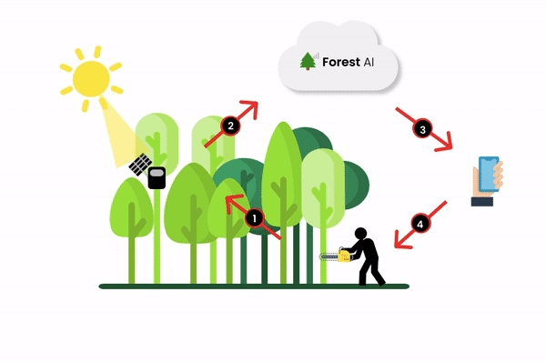
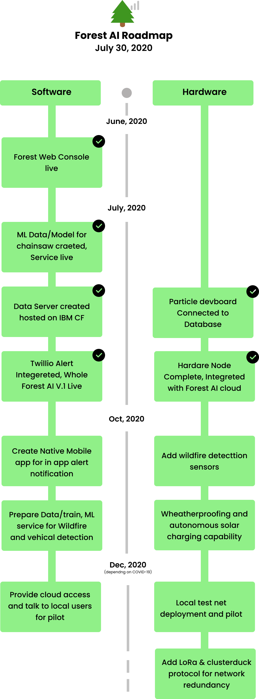

# 

  

## Contents

1. [Short description](#short-description)
1. [Demo video](#demo-video)
1. [How it Works](#how-it-works)
1. [Project roadmap](#project-roadmap)
1. [Getting started](#getting-started)
1. [Live demo](#live-demo)
1. [Built with](#built-with)
1. [Contributing](#contributing)
1. [Authors](#authors)
1. [License](#license)

## Short description

### What's the problem?

Forest are essential for life on earth, they regulate our climate, filter the water and purify the air. But they are being destroyed at an alarming rate. Every two second forest area size of a football field is destroyed due to illegal logging.

Deforestation accounts for more greenhouse gases than trains, planes and cars of the whole planet combined together. It contributes 17% to climate change while vehicles contribute 13% only. According to the INTERPOL, 90% of the logging is illegal which means preventing it can be the easiest and the cheapest way to fight the climate change. Local law enforcement try their best to protect it but illegal logging is hard to detect due to dense and wide forest.

### How can technology help?

If we can design a system that can monitor whole forest area 24/7 and detect the enviromental acostics automatically, first responders can show up stop any illegal activity happening.

### The Idea

Welcome to Forest AI ! A vigilant system that detects and alerts illegal deforestation in realtime. A smart solar powered device is deployed under tree canopies listening for all sorts of sounds. As soon as sound of chainsaw is detected in forest, device picks it up and sends an alert through a standard cellphone network to the nearest forest-ranger & first responders so that they can intervene immediately and stop it.

## Demo video

## How it Works

## The architecture

1. The **Forest Sensors** deployed in forest monitors and pushes raw alert into DB when unusual audio is heard
2. **Data server** passes this raw data to **ML-service** which classifies alerts as chainsaw or no chainsaw. Both of the services are hosted on IBM Cloud Foundry
3. If a chainsaw sound is detected then the alert is pushed into DB and Call/SMS alerts are generated using twillio API and sent to first responders
4. Now alerts which are classfied will also be shown in **Forest Console** on a map, which is used to manage network of Forest sensor

## Project Roadmap

## Getting started

This project is divided into independant repositories - go through each repo's installation guide one by one. All 3 services mentioned above in live section are also available live for testing.

## Live demo

You can find a running system to test at

- [Forest Console](http://console.forestai.tech/home) - The admin webapp
- [Data Server](https://data-service.eu-gb.cf.appdomain.cloud) - The data orchestration server
- [ML Service](https://ml-server.eu-gb.cf.appdomain.cloud) - The audio classifer service

## Built with

- [IBM Cloud Foundry](https://www.ibm.com/my-en/cloud/cloud-foundry?p1=Search&p4=43700056108279779&p5=e&cm_mmc=Search_Google-_-1S_1S-_-AS_IN-_-ibm%20cloud%20foundry_e&cm_mmca7=71700000065340837&cm_mmca8=kwd-336499027875&cm_mmca9=Cj0KCQjwgo_5BRDuARIsADDEntRWcREi8wJdRinabS_D-SMAW_b0EVIkedH8YLiXP7grZrbQUCmXXo8aAhlwEALw_wcB&cm_mmca10=453013934834&cm_mmca11=e&gclsrc=aw.ds&&gclid=Cj0KCQjwgo_5BRDuARIsADDEntRWcREi8wJdRinabS_D-SMAW_b0EVIkedH8YLiXP7grZrbQUCmXXo8aAhlwEALw_wcB) - App deployment service

## Contributing

Please read [CONTRIBUTING.md](CONTRIBUTING.md) for details on our code of conduct, and the process for submitting pull requests to us.

## Authors

- **Vikas Singh** - _Initial work_ - [singh-vikas-m](https://github.com/singh-vikas-m)
- **Ratan Singh** - _Initial work_ - [Ratansingh648](https://github.com/Ratansingh648)

## License

This project is licensed under the Apache 2 License - see the [LICENSE](LICENSE) file for details
